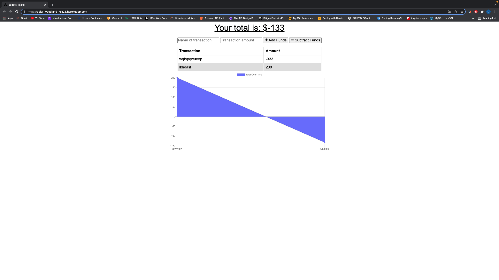

# im-broke-baby
Budget Tracker Application

## Description 

* This is a Budget Application that can be run offline with the use of mongoose 

## User Story 

* AS AN avid traveler
I WANT to be able to track my withdrawals and deposits with or without a data/internet connection
SO THAT my account balance is accurate when I am traveling 

## Features

* Add Products with a Negative or Positive input
* Add Income 
* Add Expenses 
* Toggle Installation from browser 
* Use the full functioning application offline 

## Installation

*  Follow Heroku Link 

## Dependencies

* [Express]

## License

* ISC

## Credits 

* [Marcio Ramos]{https://github.com/Jump89}

## Resources 

* No Resources for this Application

## Front End

* HTML
* CSS
* Bootstrap 5 
* Javascript

## Backend

* [node.js](https://nodejs.org/en/)
* [Mongodb](https://account.mongodb.com/account/login?n=%2Fv2%2F62203e55fa0eeb66198eea53%23security%2Fnetwork%2FaccessList)
* [Mongoose](https://mongoosejs.com/docs/api.html)
* [Express](https://expressjs.com/en/api.html)
 
## Repo

* (https://github.com/Jump89/im-broke-baby)

## Heroku Link 

* (https://polar-woodland-76123.herokuapp.com/
)
## Walk Through Video 

* No Walk Through Video for this Application

## Screen Shoot of Application

* 